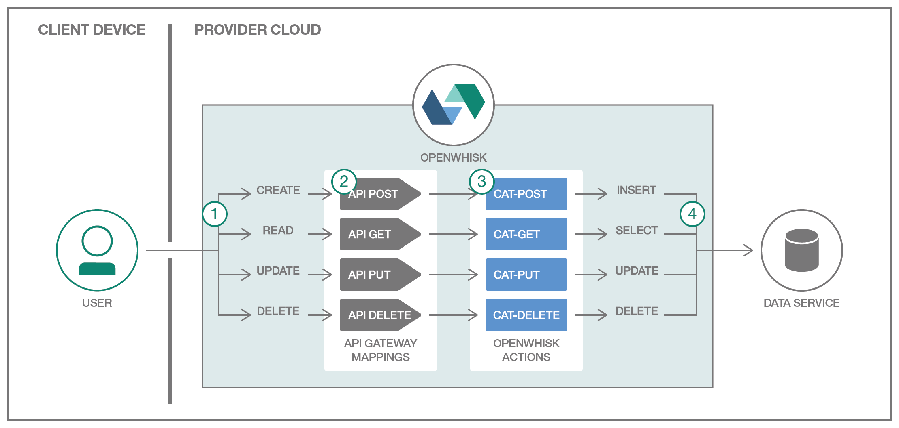

[](https://travis-ci.org/IBM/openwhisk-serverless-apis)

# OpenWhisk로 구성하는 서버리스 API

*다른 언어로 보기: [English](README.md).*

이 과정은 서버리스, 이벤트 중심 아키텍쳐가 어떻게 HTTP REST API 호출에 대응하여 자동으로 확장되는 코드를 실행하는지 보여줍니다. API 엔드포인트가 호출 되기 전까지 소비되는 리소스가 없습니다. 엔드포인트가 호출 될 때, 리소스는 HTTP 메소드에서 개별적으로 현재 필요로하는 부하에 정확히 맞춰서 프로비저닝됩니다.

이 과정에서는 MySQL 데이터베이스에 데이터를 쓰고 읽는 네 가지 OpenWhisk 액션(JavaScript로 작성)을 보여 주며 액션이 어떻게 데이터 서비스와 함께 동작하고 HTTP 요청에 응답하여 로직을 실행하는지 보여줍니다.

첫 번째 액션은 HTTP POST 요청에 대해 매핑됩니다. 그리고, 제공된 고양이 이름과 색깔 정보를 데이터베이스에 추가합니다. 두 번째 액션은 PUT 요청에 매핑되어 기존 고양이에 대한 필드를 갱신합니다. 세 번째 액션은 주어진 고양이에 대한 정보를 반환하는 GET 요청에 매핑됩니다. 네 번째 액션은 주어진 고양이 데이터를 삭제합니다.

Bluemix의 Node.js 런타임은 NPM 모듈의 내장 화이트리스트를 제공합니다. 이 데모에서는 높은 수준의 확장성 제공을 위해 MySQL 클라이언트와 같은 추가적인 Node.js 종속성이 ZIP 파일로 패키지되는 커스텀 액션에 대해 안내합니다.



## 포함된 구성 요소

- OpenWhisk
- ClearDB 또는 Compose (MySQL)

## 전제 조건

기본적인 OpenWhisk 프로그래밍 모델에 대한 이해가 필요합니다. 만약 그렇지 않다면, [액션, 트리거 그리고 
룰에 대한 데모를 먼저 확인 하십시오](https://github.com/IBM/openwhisk-action-trigger-rule).

또한, Bluemix 계정과 최신 버젼의 [OpenWhisk 명령행 도구(`wsk`)를 설치 후  실행 경로(PATH)에 추가해야 합니다](https://github.com/IBM/openwhisk-action-trigger-rule/blob/master/docs/OPENWHISK-ko.md).

이 엔드-투-엔드 예제에 대한 대안으로서, 이 샘플의 [기본적인 "빌딩 블럭" 버젼](https://github.com/IBM/openwhisk-rest-api-trigger)도 고려해 볼 수 있습니다.

## Steps

1. [MySQL 프로비저닝하기](#1-mysql-프로비저닝하기)
2. [OpenWhisk 액션 및 매핑하기](#2-openwhisk-액션-및-매핑하기)
3. [Test API 엔드포인트](#3-test-api-엔드포인트)
4. [액션 및 매핑 삭제하기](#4-액션-및-매핑-삭제하기)
5. [수동으로 다시 생성](#5-수동으로-다시-생성하기)

# 1. MySQL 프로비저닝하기
Bluemix에 로그인 후 [ClearDB](https://console.ng.bluemix.net/catalog/services/cleardb-mysql-database/)나 [Compose for MySQL](https://console.ng.bluemix.net/catalog/services/compose-for-mysql/) 데이터 베이스 인스턴스를 생성하십시오. ClearDB는 단순 테스트용으로는 무료 티어를 제공합니다, 반면 Compose의 경우 더 큰 워크로드용 티어를 제공합니다.

* [ClearDB](https://console.ng.bluemix.net/catalog/services/cleardb-mysql-database/)의 경우, ClearDB 대시 보드로 로그인하고, 기본으로 생성된 데이터 베이스를 선택합니다. "Endpoint Information"에 있는 사용자 정보, 비밀번호 및 호스트 정보를 확인 합니다.

* [Compose](https://console.ng.bluemix.net/catalog/services/compose-for-mysql/)의 경우, Bluemix 콘솔의 "Service Credentials" 탭에서 해당 정보를 확인 합니다.

`template.local.env` 파일을 `local.env`로 이름을 변경하여 복사하고 `MYSQL_HOSTNAME`, `MYSQL_USERNAME`, `MYSQL_PASSWORD` 및 `MYSQL_DATABASE` 을 생성한 MySQL 인스턴스에 대한 정보로 변경합니다.

# 2. OpenWhisk 액션 및 매핑하기
`deploy.sh`는 `local.env`에서 환경 변수를 읽고, OpenWhisk 액션을 생성하며, API 매핑을 대신 해 주는  편의를 위한 스크립트 파일입니다. 나중이 이 명령들을 직접 실행하게 됩니다.

```bash
./deploy.sh --install
```
> **참고**: 에러 메시지가 나타나면, 아래 [문제 해결](#문제-해결) 영역을 참고 하기 바랍니다. 또한, [다른 배포 방법](#다른-배포-방법)을 참고 할 수 있습니다.

# 3. Test API 엔드포인트
다음과 같이 HTTP API 클라이언트를 시뮬레이션하여 `/v1/cat` 엔드포인트에 대해 엔티티를 생성, 수집, 갱신 및 삭제하는 네 개의 스크립트가 있습니다.

```bash
# POST /v1/cat {"name": "Tarball", "color": "Black"}
client/cat-post.sh Tarball Black

# GET /v1/cat?id=1
client/cat-get.sh 1 # 또는 윗 명령으로 얻은 정수형 ID 값

# PUT /v1/cat {"id": 1, "name": "Tarball", "color": "Gray"}
client/cat-put.sh 1 Tarball Gray

# DELETE /v1/cat?id=1
client/cat-delete.sh 1
```

# 4. 액션 및 매핑 삭제하기
`deploy.sh` 을 다시 사용해서 OpenWhisk 액션과 매핑을 제거합니다. 이는 다음 영역에서 하나씩 다시 만들어 볼 수 있습니다.

```bash
./deploy.sh --uninstall
```

# 5. 수동으로 다시 생성하기
이 영역은 `deploy.sh`가 어떤 것을 실행하는지 좀 더 깊숙히 들여다봄으로써 OpenWhisk 트리거, 액션, 룰 그리고 패키지가 어떻게 동작하는지 좀 더 상세히 알 수 있게 됩니다.

## 5.1 고양이 데이터 수정을 위한 OpenWhisk 액션 생성하기
고양이 데이터 관리를 위해 API의 각 메소드 (POST, PUT, GET 및 DELETE)에 대한 네 개의 액션을 생성합니다. 액션을 위한 코드는 `/actions`에 있습니다. 자 이제 첫 번째 고양이 정보를 생성하는 액션부터 시작해 보겠습니다.

> **참고**: OpenWhisk Node.js 런타임 환경에 [내장 패키지 수](https://github.com/openwhisk/openwhisk/blob/master/docs/reference.md?cm_mc_uid=33591682128714865890263&cm_mc_sid_50200000=1487347815#javascript-runtime-environments)에 대한 정보가 있습니다. 추가적인 패키지가 필요하다면, 액션 파일을 ZIP 파일 형태로 업로드 할 수 있습니다. 단일 파일와 ZIP으로 압축된 아카이브에 대한 차이에 대한 정보는 [시작 가이드](https://console.ng.bluemix.net/docs/openwhisk/openwhisk_actions.html#openwhisk_js_packaged_action)를 참고하시기 바랍니다.

### 5.1.1 cat 패키지
모든 액션들은 MySQL 데이터베이스 서비스에 의존하고 있기 때문에, 이를  패키지 레벨에서 신임정보를 한번만 설정하는것이 편리합니다. 이는 패키지에 있는 모든 액션들을 사용할 수 있게 되므로 생성 및 실행 할 때마다 각각에 대해 정의할 필요가 없어집니다.

```bash
source local.env
wsk package create cat \
  --param "MYSQL_HOSTNAME" $MYSQL_HOSTNAME \
  --param "MYSQL_USERNAME" $MYSQL_USERNAME \
  --param "MYSQL_PASSWORD" $MYSQL_PASSWORD \
  --param "MYSQL_DATABASE" $MYSQL_DATABASE
```

### 5.1.2 cat 생성 액션
POST 액션에 대한 JavaScript 코드는 `/actions/cat-post-action/index.js`에 있습니다. 이 함수는 데이터베이스 연결을 위한 `mysql` 클라이언트 npm 패키지에 의존적입니다. `package.json`을 파싱하는 `npm install` 명령으로 패키지를 설치하고 애플리케이션과 이에 종속적인 요소들을 포함하는 ZIP 파일을 생성 하십시오.
```bash
cd actions/cat-post-action
npm install
zip -rq action.zip *
```
다음으로 `action.zip`으로 부터 액션을 생성하기 위해 OpenWhisk CLI를 사용합니다.
```bash
# 생성
wsk action create cat/cat-post \
  --kind nodejs:6 action.zip \
  --web true
```

그 다음 테스트를 위해 `wsk` CLI를 이용하여 액션을 수동으로 호출합니다.

```bash
# 테스트
wsk action invoke \
  --blocking \
  --param name Tarball \
  --param color Black \
  cat/cat-post
```

GET, PUT 그리고 DELETE 액션에 대해 위의 생성 및 테스트를 반복합니다.

> **참고**: 아래 테스트에서 숫자 1을 위의 POST 액션을 실행한 결과로 얻은 실제 id 값으로 변경합니다.

### 5.1.3 cat 읽기 action
```bash
# 생성
cd ../../actions/cat-get-action
npm install
zip -rq action.zip *
wsk action create cat/cat-get \
  --kind nodejs:6 action.zip \
  --web true

# 테스트
wsk action invoke \
  --blocking \
  --param id 1 \
  cat/cat-get
```

### 5.1.4 cat 갱신 액션
```bash
# 생성
cd ../../actions/cat-put-action
npm install
zip -rq action.zip *
wsk action create cat/cat-put \
  --kind nodejs:6 action.zip \
  --web true

# 테스트
wsk action invoke \
  --blocking \
  --param name Tarball \
  --param color Gray \
  --param id 1 \
  cat/cat-put

wsk action invoke \
  --blocking \
  --param id 1 \
  cat/cat-get
```

### 5.1.5 cat 삭제 액션
```bash
# 생성
cd ../../actions/cat-delete-action
npm install
zip -rq action.zip *
wsk action create cat/cat-delete \
  --kind nodejs:6 action.zip \
  --web true

# 테스트
wsk action invoke \
  --blocking \
  --param id 1 \
  cat/cat-delete

wsk action invoke \
  --blocking \
  --param id 1 \
  cat/cat-get
```

## 5.2 REST API 엔트포인트 생성하기
이제 리소스 엔드포인트인 (`/cat`)을 `GET`, `DELETE`, `PUT`, 및 `POST` HTTP 메소드에 매핑하고, 이에 대응하는 OpenWhisk 액션과 연결하십시오. 그리고 테스트를 위해 클라이언트 스크립트를 사용하여 테스트 하십시오.

```bash
# 생성
wsk api create -n "Cats API" /v1 /cat post cat/cat-post
wsk api create /v1 /cat put cat/cat-put
wsk api create /v1 /cat get cat/cat-get
wsk api create /v1 /cat delete cat/cat-delete

# 테스트

# POST /v1/cat {"name": "Tarball", "color": "Black"}
client/cat-post.sh Tarball Black

# GET /v1/cat?id=1
client/cat-get.sh 1 # 1을 위의 POST 액션의 결과로 얻은 id로 대체하십시오

# PUT /v1/cat {"id": 1, "name": "Tarball", "color": "Gray"}
client/cat-put.sh 1 Tarball Gray

# DELETE /v1/cat?id=1
client/cat-delete.sh 1
```

## 5.3 정리하기
모든 API 매핑을 제거하고 액션을 삭제하십시오.

```bash
wsk api delete /v1
wsk action delete cat/cat-post
wsk action delete cat/cat-put
wsk action delete cat/cat-get
wsk action delete cat/cat-delete
wsk package delete cat
```

# 문제 해결
가장 먼저 OpenWhisk 활성화 로그에서 오류를 확인 하십시오. 명령창에서 `wsk activation poll`을 이용하여 로그 메시지를 확인하거나 [Bluemix의 모니터링 콘솔](https://console.ng.bluemix.net/openwhisk/dashboard)에서 시각적으로 상세정보를 확인해 보십시오.

오류가 즉각적으로 분명하지 않다면, [최신 버젼의 `wsk` CLI](https://console.ng.bluemix.net/openwhisk/learn/cli)가 설치되어 있는지 확인하십시오. 만약 이전 것이라면 다운로드하고 업데이트 하십시오.
```bash
wsk property get --cliversion
```

# 다른 배포 방법
`deploy.sh`은 향후 [`wskdeploy`](https://github.com/openwhisk/openwhisk-wskdeploy)로 교체될 예정입니다. `wskdeploy`는 선언된 트리거, 액션 및 규칙을 OpenWhisk에 배포하기 위해 manifest를 사용합니다.

또한 다음 버튼을 사용하여 이 저장소의 복사본을 복제하고 DevOps 툴 체인의 일부로 Bluemix에 배포 할 수 있습니다. 딜리버리 파이프 라인 아이콘 아래에서 OpenWhisk 및 MySQL 신임 정보를 제공하고 Create를 클릭 한 후 딜리버리 파이프 라인에 대한 Deploy Stage를 실행하십시오.

[](https://bluemix.net/deploy?repository=https://github.com/IBM/openwhisk-serverless-apis.git)

# 라이센스
[Apache 2.0](LICENSE.txt)
