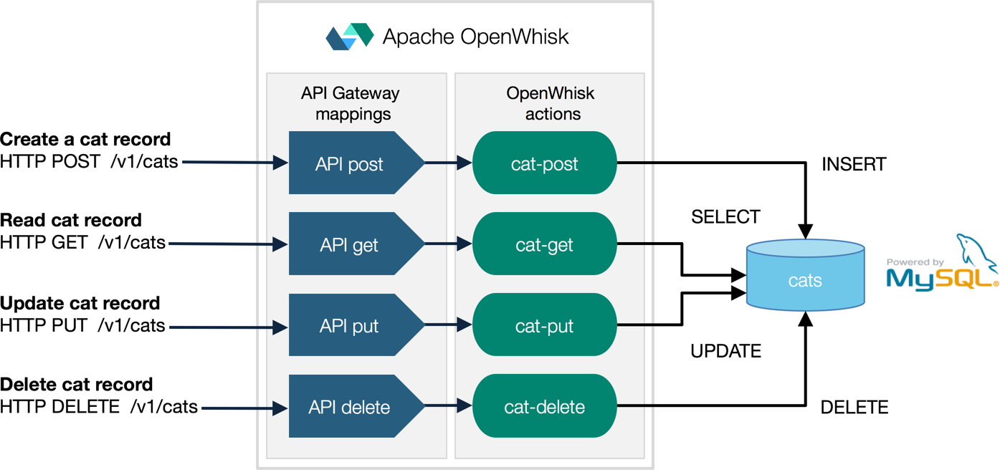

[](https://travis-ci.org/IBM/openwhisk-serverless-apis)

# OpenWhisk 101 - OpenWhisk and Serverless APIs
This project provides sample code for creating serverless REST APIs with Apache OpenWhisk on IBM Bluemix. It should take no more than 10 minutes to get up and running.

This sample assumes you have a basic understanding of the OpenWhisk programming model, which is based on Triggers, Actions, and Rules. If not, you may want to [explore this demo first](https://github.com/IBM/openwhisk-action-trigger-rule).

Serverless platforms like Apache OpenWhisk provide a runtime that scales automatically in response to demand, resulting in a better match between the cost of cloud resources consumed and business value gained.

One of the key use cases for OpenWhisk is to map HTTP REST API calls to business logic functions that create, read, update, and delete data.

**_Instead of pre-provisioning resources in anticipation of demand, OpenWhisk actions are started and destroyed only as needed in response to demand. Each API method handler action scales (and is billed) independently in direct correlation to the volume of requests_**.

Once you complete this sample application, you can move on to more complex serverless application use cases, such as those named _OpenWhisk 201_ or tagged as [_openwhisk-use-cases_](https://github.com/search?q=topic%3Aopenwhisk-use-cases+org%3AIBM&type=Repositories).

# Overview of an HTTP REST API backed by OpenWhisk
The sample code demonstrates how to build a simple CRUD (create, read, update, delete) interface for working with an entity that represents a cat that has an id, name, and color.

HTTP endpoints for each call - corresponding to the `POST`, `GET`, `PUT`, and `DELETE` HTTP methods - are mapped to autoscaling OpenWhisk actions that modify cat state in a MySQL database.



The Node.js runtime on Bluemix provides a [built-in whitelist of NPM modules](https://github.com/openwhisk/openwhisk/blob/master/docs/reference.md#javascript-runtime-environments) for regular, single file JavaScript actions. This demo goes a step further to highlight how additional Node.js dependencies - such as the MySQL client - can be packaged in a ZIP file together with custom actions to provide a high level of extensibility.

# Installation
Setting up this sample involves configuration of OpenWhisk and MySQL on IBM Bluemix. [If you haven't already signed up for Bluemix and configured OpenWhisk, review those steps first](docs/OPENWHISK.md).

These instructions will have you:
* [Provision a MySQL database on Bluemix](#provision-a-mysql-database-on-bluemix)
* [Use the `deploy.sh` script to create the OpenWhisk packages, triggers, actions and rules](#create-the-openwhisk-packages-triggers-actions-and-rules)
* [Test the REST API endpoints](#test-the-rest-api-endpoints)
* [Remove the packages, triggers, actions and rules](#remove-the-packages-triggers-actions-and-rules)
* [Recreate the deployment manually to understand the sample more deeply](#recreate-the-deployment-manually-to-understand-the-sample-more-deeply)

### Provision a MySQL database on Bluemix
You can create a MySQL database through the Bluemix console, or connect to your own instance. You will need to configure this example with host, user, password and database name.

To create a MySQL instance, log into the Bluemix console, go to catalog, and provision a [ClearDB MySQL database instance](https://console.ng.bluemix.net/catalog/services/cleardb-mysql-database/) or a [Compose for MySQL](https://console.ng.bluemix.net/catalog/services/compose-for-mysql/) database instance. ClearDB has a free tier for simple testing, while Compose has tiers for greater production workloads.

* For [ClearDB](https://console.ng.bluemix.net/catalog/services/cleardb-mysql-database/), log into the ClearDB dashboard, and select the default database created for you. Grab the user, password and host information under "Endpoint Information".

* For [Compose](https://console.ng.bluemix.net/catalog/services/compose-for-mysql/), grab the information from the Service Credentials tab in the Bluemix console.

Copy `template.local.env` to a new file named `local.env` and update the `MYSQL_HOSTNAME`, `MYSQL_USERNAME`, `MYSQL_PASSWORD` and `MYSQL_DATABASE` values to reflect the values for your MySQL  instance.

### Create the OpenWhisk packages, triggers, actions and rules
To get started quickly, use the `deploy.sh` convenience script that reads the environment variables out of `local.env` and injects them where needed.

`deploy.sh` executes the package, trigger, action, and rule creating commands using the `wsk` CLI tool. In a later section of this tutorial you will these commands yourself.

```bash
./deploy.sh --install
```

> **Note**: `deploy.sh` will be replaced with the [`wskdeploy`](https://github.com/openwhisk/openwhisk-wskdeploy) tool in the future. `wskdeploy` uses a manifest to orchestrate the triggers, actions, and rules deployed to OpenWhisk.

## Test the REST API endpoints
Now that the endpoints have been created, let's send HTTP requests to them. You can use  `cat-post.sh`, `cat-get.sh`, `cat-put.sh`, `cat-delete.sh` helper scripts that simulate API clients to create, get, update and delete entities against the `/v1/cats` endpoint.

```bash
./cat-post.sh [name of cat] [color of cat]
./cat-get.sh [id]
./cat-put.sh [id] [name of cat] [color of cat]
./cat-delete.sh [id]
```

## Remove the packages, triggers, actions and rules
Delete the OpenWhisk resources that were created, using the same convenience script. We'll recreate them step by step in the next section.

```bash
./deploy.sh --uninstall
```

## Recreate the deployment manually to understand the sample more deeply
Now we're ready to take a deeper look into what's going on in the `deploy.sh` script so that you understand how to work with OpenWhisk triggers, actions, rules, and packages in more detail.

### Create OpenWhisk actions to modify cat data
Start by create custom actions to manage cat data. We will create four actions, one for each method (POST, PUT, GET, and DELETE) of our API.

> There are a [number of packages available](https://github.com/openwhisk/openwhisk/blob/master/docs/reference.md?cm_mc_uid=33591682128714865890263&cm_mc_sid_50200000=1487347815#javascript-runtime-environments) by default in the OpenWhisk runtime environment. For packages that are not included by default, you can upload them in a ZIP file when you create your action. If your application requires no additional packages, you can create an action by uploading your JavaScript action file directly. In those cases there is no need to create and upload an archive. More information on the two approaches is available in the [getting started documentation](https://console.ng.bluemix.net/docs/openwhisk/openwhisk_actions.html#openwhisk_js_packaged_action).

The code for the actions is located in `/actions`. Let's start with the action action that creates a cat record first.

#### The cat create action
The JavaScript function for the POST action is located in `/actions/cat-post-action/index.js`. This function depends on a Node.js package: `mysql` which we need to connect to the database. Install the Node packages using `npm install` and create an archive that includes your application and your Node dependencies.
```bash
  cd actions/cat-post-action
  npm install
  zip -rq action.zip *
```
Once you have the archive built, you can use the OpenWhisk CLI to create an action with it, passing along environment variables from `local.env`.
```bash
source local.env

# Create
wsk action create cat-post --kind nodejs:6 action.zip \
  --param "MYSQL_HOSTNAME" $MYSQL_HOSTNAME \
  --param "MYSQL_USERNAME" $MYSQL_USERNAME \
  --param "MYSQL_PASSWORD" $MYSQL_PASSWORD \
  --param "MYSQL_DATABASE" $MYSQL_DATABASE
```

Notice that the command above passes in parameters needed to connect to your MySQL database. Specifying values at action creation will allow these to apply each time you call your action, instead of having to pass them in each time it's invoked (that is, as runtime parameters).

You can then manually invoke the method using the `wsk` CLI to test that the logic is correct.

```bash
# Test
wsk action invoke --blocking --param name Henry --param color Black cat-post
```

Repeat the above steps to create and test the corresponding PUT, GET, and DELETE actions.

#### The cat update action
```bash
# Create
cd actions/cat-put-action
npm install
zip -rq action.zip *
wsk action create cat-put --kind nodejs:6 action.zip \
  --param "MYSQL_HOSTNAME" $MYSQL_HOSTNAME \
  --param "MYSQL_USERNAME" $MYSQL_USERNAME \
  --param "MYSQL_PASSWORD" $MYSQL_PASSWORD \
  --param "MYSQL_DATABASE" $MYSQL_DATABASE

# Test
wsk action invoke --blocking --param name Henry --param color Gray --param id 1 cat-put
```

#### The cat read action
```bash
# Create
cd actions/cat-get-action
npm install
zip -rq action.zip *
wsk action create cat-get --kind nodejs:6 action.zip \
  --param "MYSQL_HOSTNAME" $MYSQL_HOSTNAME \
  --param "MYSQL_USERNAME" $MYSQL_USERNAME \
  --param "MYSQL_PASSWORD" $MYSQL_PASSWORD \
  --param "MYSQL_DATABASE" $MYSQL_DATABASE

# Test
wsk action invoke --blocking --param id 1 cat-get
```

#### The cat delete action
```bash
# Create
cd actions/cat-delete-action
npm install
zip -rq action.zip *
wsk action create cat-delete --kind nodejs:6 action.zip \
  --param "MYSQL_HOSTNAME" $MYSQL_HOSTNAME \
  --param "MYSQL_USERNAME" $MYSQL_USERNAME \
  --param "MYSQL_PASSWORD" $MYSQL_PASSWORD \
  --param "MYSQL_DATABASE" $MYSQL_DATABASE

# Test
wsk action invoke --blocking --param id 1 cat-delete
```

### Create REST API endpoints
Now that we have our actions, we can create REST URLs to attach to those actions. Create four endpoints using the following commands. This will map an resource endpoint (`/cats`) to the `GET`, `DELETE`, `PUT`, and `POST` HTTP methods and associate it with the corresponding OpenWhisk action you just created.

```bash
# Create
wsk api-experimental create -n "Cats API" /v1 /cats post cat-post
wsk api-experimental create /v1 /cats put cat-put
wsk api-experimental create /v1 /cats get cat-get
wsk api-experimental create /v1 /cats delete cat-delete

# Test
./cat-post.sh Henry Black
./cat-get.sh 1
./cat-put.sh 1 Henry Gray
./cat-delete.sh 1
```

### Clean up
To remove all the API mappings and delete the actions, you can use `./deploy.sh --uninstall` or perform the deletions manually.

```bash
wsk api-experimental delete /v1
wsk action delete cat-post
wsk action delete cat-put
wsk action delete cat-get
wsk action delete cat-delete
```

## Troubleshooting
The first place to check for errors is the OpenWhisk activation log. You can view it by tailing the log on the command line with `wsk activation poll` or you can drill into details visually with the [monitoring console on Bluemix](https://console.ng.bluemix.net/openwhisk/dashboard).

# License
Licensed under the [Apache 2.0 license](LICENSE.txt).
