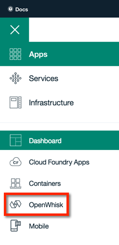
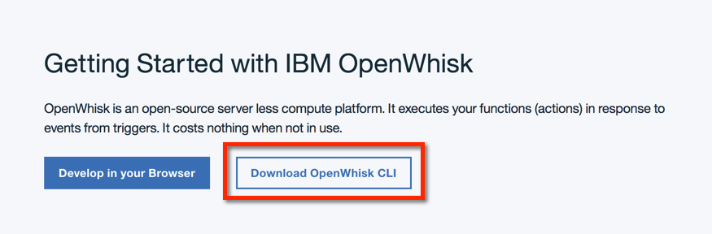
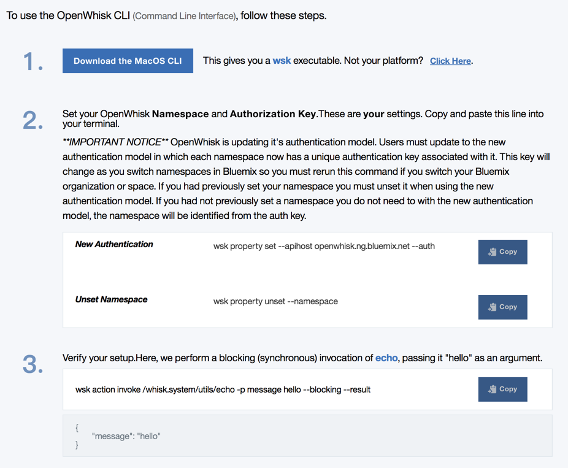

## Sign up for a Bluemix account
Begin by going to [bluemix.net](https://console.ng.bluemix.net/) and signing up for a free account. After you activate your account, set an organization (for example, *MyACMEorg*) and space (for example *test*), click on OpenWhisk in the left navigation.

## Install, configure, and test the OpenWhisk CLI
Once there, click the "Download OpenWhisk CLI" button.

Then, follow the three steps to install, configure, and test connectivity. Note that the authorization key is not shown here.

